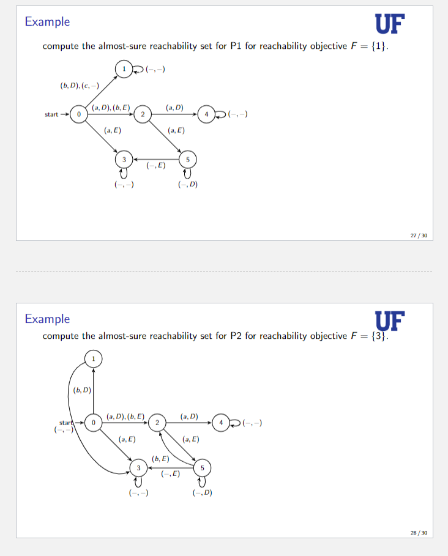

# 2Player_Concurrent

**How to Run Code:**
1. Clone repository https://github.com/mcgrathkevin/2Player_Concurrent.git
2. Pull and run docker environment with abhibp1993/ggsolver:latest
3. Run **p1_reach_1_ex.py** or **p2_reach_3_ex.py** which import the DTPCGame class from **dtpc.py** and calculate and display the almost-sure winning region states and  policy.

